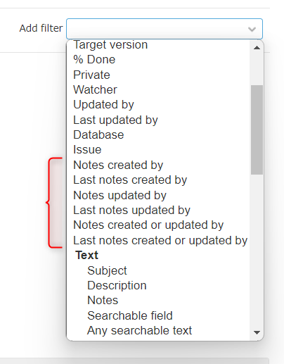

# Redmine note author filter
This is a plugin for Redmine.  
This plugin adds several filters for filtering related to note authors.




## Installation
### Using Git
1. Clone the plugin repository to your Redmine plugins directory:
   ```bash
   cd /path/to/redmine/plugins/
   git clone https://github.com/sk-ys/redmine_note_author_filter.git
2. Restart your Redmine instance.

### Without Git

1. Download zip file from the [release page](https://github.com/sk-ys/redmine_note_author_filter/releases) or the [latest main repository](https://github.com/sk-ys/redmine_note_author_filter/archive/refs/heads/main.zip).

2. Extract the ZIP file to your Redmine plugins directory. The name of the unzipped directory must be `redmine_note_author_filter`.

3. Restart your Redmine instance.


## Available filters
- Notes created by
- Last notes created by
- Notes updated by [^1]
- Last notes updated by [^1]
- Notes created or updated by [^1]
- Last notes created or updated by [^1]

[^1]: Redmine 5.1 and above only
